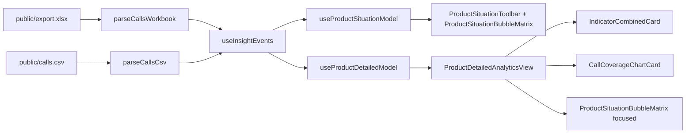

# Архитектура проекта

## 1. Цель архитектуры
Проект разделен на два независимых слоя:
1. **Logic layer** — вся бизнес-логика, вычисления, фильтры, типы и хуки состояния.
2. **Components layer** — только представление и композиция UI.

Это позволяет тестировать расчеты отдельно от рендера и упрощает поддержку.

## 2. Границы слоев

### Logic layer
Путь:
`/Users/bbeglerov/Developer/Playground/graphs.bbeglerov.dev/features/insight-dashboard/logic`

Правила:
1. Нет импортов из feature-компонентов.
2. Нет JSX.
3. Допускаются импорты из `config/*` и общих utility.
4. Вход: `InsightEvent[]`, фильтры и параметры гранулярности.
5. Выход: готовые модели для UI (`ProductBubblePoint[]`, `DetailedAnalyticsModel`, thresholds и т.д.).

### Components layer
Путь:
`/Users/bbeglerov/Developer/Playground/graphs.bbeglerov.dev/features/insight-dashboard/components`

Правила:
1. Компоненты не вычисляют бизнес-формулы.
2. Компоненты получают готовые данные из hooks/logic-функций.
3. UI-стили и layout держатся в компонентах, а не в logic.

### Config layer
Путь:
`/Users/bbeglerov/Developer/Playground/graphs.bbeglerov.dev/features/insight-dashboard/config`

Содержит:
1. Константы порогов/цветов/дефолтов (`constants.ts`).
2. Конфигурацию help-dialog (`tooltips.ts`).
3. Тексты индикаторных подсказок (`indicator-tooltip-copy.ts`).

## 3. Поток данных

## 4. Основные модули logic
1. `product-dissatisfaction-score.ts`
   - расчет метрики «Оценка неудовлетворенности продуктом»;
   - вычисление зон (green/yellow/red);
   - подготовка bubble points для главной и timeline для детальной.
2. `detailed-analytics.ts`
   - фильтрация событий детальной страницы;
   - weekly/monthly бакеты;
   - series для combined indicator cards и coverage chart;
   - parse/serialize query + localStorage preferences.
3. `date-bucketing.ts`
   - ISO-week границы;
   - нормализация периодов;
   - формат подписей бакетов для осей/tooltip.

## 5. Основные UI entrypoints
1. `app/page.tsx`
   - загружает события через `useInsightEvents`;
   - собирает модель главной через `useProductSituationModel`;
   - рендерит `ProductSituationToolbar` и `ProductSituationBubbleMatrix`.
2. `app/product-analytics/page.tsx`
   - загружает события через `useInsightEvents`;
   - передает в `ProductDetailedAnalyticsView`.

## 6. Правила добавления нового функционала
1. Сначала добавлять типы в `logic/types.ts`.
2. Новые расчеты/агрегации добавлять в `logic/*`.
3. Если нужен stateful orchestration — в `logic/hooks/*`.
4. Только после этого подключать UI в `components/*`.
5. Любые тексты/help-контент класть в `config/*` или отдельный компонент help-content.

## 7. Анти-паттерны (что не делать)
1. Не добавлять доменные формулы прямо в React-компоненты.
2. Не дублировать one-off утилиты в разных карточках.
3. Не связывать компоненты напрямую с источником данных (`fetch`) — это ответственность hooks/adapter слоя.
4. Не смешивать legacy-названия метрики в коде и UI.
